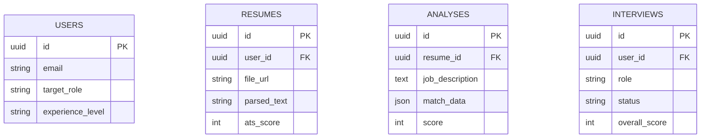

# Implementation Plan: AI Resume + Interview Preparation Platform

This plan is optimized for a **solo developer** to build a high-end, freelance-ready SaaS platform. It prioritizes speed, visual excellence, and zero infrastructure management by using **Supabase** and **Next.js**.

## User Review Required

> [!IMPORTANT]
> **Consolidated Backend**: We are replacing Claude's 3-backend suggestion with a **single Next.js app** for logic and a **single Python FastAPI service** for AI processing.
> **Supabase Choice**: I have selected Supabase because it handles Auth, Database, and File Storage in one tool, saving you roughly 40+ hours of manual setup.

---

## 1. Technical Stack (Solo-Dev Optimized)

| Layer | Technology | Rationale |
| :--- | :--- | :--- |
| **Frontend** | Next.js 14 (App Router) | Best for SEO, speed, and modern React features. |
| **Styling** | Tailwind CSS + shadcn/ui | Premium, consistent UI components out of the box. |
| **Animations**| Framer Motion | Provides the "Wow" factor with smooth transitions. |
| **Backend-as-a-Service** | **Supabase** | Replaces PostgreSQL, Prisma, NextAuth, and AWS S3. |
| **AI Processing** | **Python (FastAPI)** | Best for NLP (spaCy), PDF parsing, and logic. |
| **AI Intelligence**| **Claude 3.5 Sonnet** | Industry-leading text reasoning for resumes. |
| **STT Engine** | **OpenAI Whisper** | Most accurate voice-to-text for interviews. |

---

## 2. Proposed Phases

### Phase 1: Foundation & "Premium" Design (Week 1)
Build the shell that looks like a $10,000 product.

*   **[NEW] Project Setup**: Initialize Next.js with TypeScript and Tailwind.
*   **[NEW] Design System**: Setup shadcn/ui with a custom high-end theme (Dark mode, deep violets, smooth gradients).
*   **[NEW] Authentication**: Connect Supabase Auth for Google/Email login.
*   **[NEW] Dashboard UI**: Create a responsive sidebar and a "Overview" dashboard with dummy data and stats.

### Phase 2: The Resume Analysis Engine (Week 1-2)
The "Brain" of the platform.

*   **[NEW] Python AI Service**: Set up a FastAPI microservice.
    *   `parsers/pdf.py`: Uses `PyMuPDF` to extract text from resumes.
    *   `nlp/scorer.py`: Uses `spaCy` to extract keywords and calculate matching scores.
*   **[NEW] Resume Upload**: Implement a drag-and-drop uploader in Next.js that saves to Supabase Storage.
*   **[NEW] Analysis UI**: A gorgeous report page showing:
    *   Circular Match Score.
    *   Missing Keywords (Chips).
    *   Section-by-section breakdown.

### Phase 3: AI Rewrite & Editor (Week 2)
The feature that users will pay for.

*   **[NEW] Claude Integration**: Connect the Python service to Anthropic's Claude 3.5 API.
*   **[NEW] Smart Tailoring**: A feature where users paste a Job Description and Claude rewrites their resume bullet points to match.
*   **[NEW] PDF Export**: Use `react-pdf` to generate a professional PDF directly in the browser after the AI improvements are made.

### Phase 4: Mock Interview System (Week 3)
The advanced edge over competitors.

*   **[NEW] Interview Flow**: A specialized UI that mimics a video call (with user camera/voice).
*   **[NEW] Voice STT**: Integrate OpenAI Whisper to transcribe user's spoken answers in real-time.
*   **[NEW] STAR Evaluation**: Claude evaluates the transcription and gives a score (Situation, Task, Action, Result).
*   **[NEW] Real-time Feedback**: Use Server-Sent Events (SSE) from FastAPI to stream feedback as the user speaks.

---

## 3. Database Schema (Supabase/PostgreSQL)

---

## 4. Verification Plan

### Automated Tests
*   **Python (PyTest)**: Verify the PDF parser extracts text accurately.
*   **Frontend (Playwright)**: Test the resume upload flow and Auth journey.

### Manual Verification
*   **ATS Test**: Upload a resume, paste a JD, and verify that the "Missing Keywords" section correctly identifies gaps.
*   **Voice Test**: Conduct a 3-minute mock interview and verify that the transcription matches the speech.
